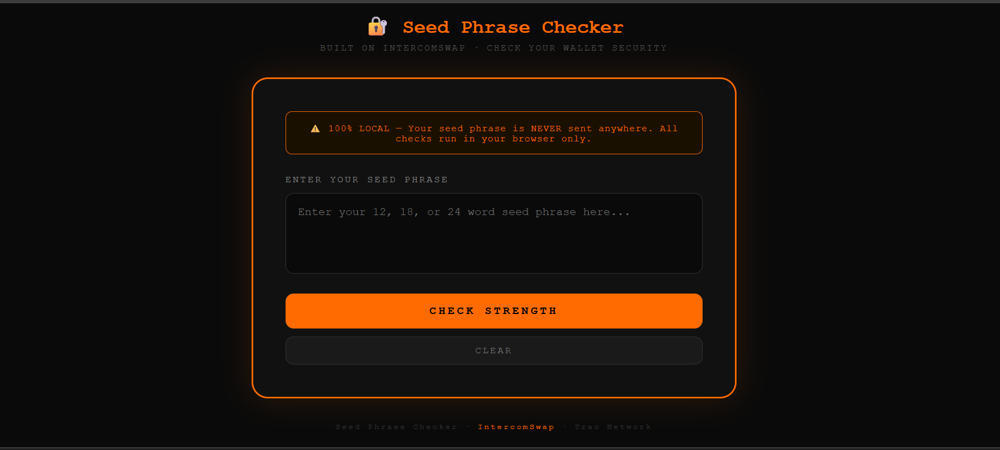
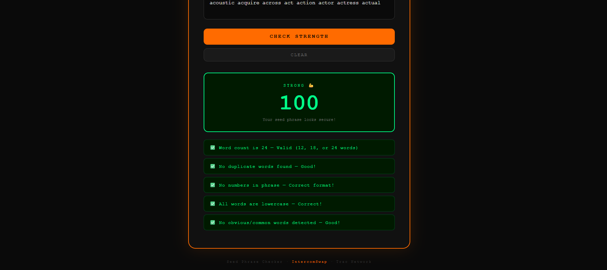

# Seed Phrase Checker - Trac Network

A TRAC-themed Seed Phrase Strength Checker built on IntercomSwap.
Check your crypto wallet seed phrase security — 100% locally, nothing sent anywhere.


## Features
- 🔐 Checks seed phrase strength
- ✅ Validates word count (12, 18, 24 words)
- 🔍 Detects duplicate words
- ⚠️ Detects obvious/weak words
- 📊 Security score out of 100
- ⚡ 100% runs in browser — no data sent anywhere

## Built On
- IntercomSwap by Trac Systems
- Node.js + Express

## How To Run
npm install
npm start

Then open: http://localhost:3000

## Checker Result


## Trac Address For Payout
`trac1q5r79wn6lc4p3x4desyjw8rna0ml6pakz873vt7r9ary7qlwvgdqwx24d0`
```

---

## Why Use Backticks ✅

The backtick symbol **`** makes the address appear in a **code box** like this:

`trac1q5r79wn6lc4p3x4desyjw8rna0ml6pakz873vt7r9ary7qlwvgdqwx24d0`

- ✅ Looks professional
- ✅ Easy to copy with one click
- ✅ Stands out clearly
- ✅ No accidental formatting issues

---

## Where Is The Backtick Key?

On Windows keyboard:
```
Top left of keyboard
Same key as ~
Just below the ESC key

## Competition Entry
- Fork of: https://github.com/Trac-Systems/intercom-swap
- Built for: Intercom Vibe Competition
- Category: IntercomSwap Fork
